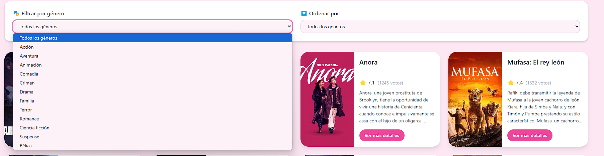

# 🎬 Recomendador de Películas - Full Stack App

Este proyecto fue desarrollado para **mejorar mis habilidades como desarrolladora Full Stack** y aprender nuevas tecnologías.  
Permite buscar películas, filtrarlas por género, ordenarlas por popularidad o puntuación, y obtener recomendaciones personalizadas.

---

## ✨ Características principales

- 🔍 **Búsqueda de películas** con filtros combinables por **género**, **orden** y **popularidad**.
- 💡 **Sistema de login y logout** con validaciones visuales y mensajes claros.
- 👁 **Mostrar/Ocultar contraseña** al registrarse o iniciar sesión.
- 👤 **Perfil de usuario** con información personal y posibilidad de eliminar cuenta.
- 🔐 **Acceso restringido**: no se puede navegar si no hay sesión iniciada.
- 🎞 **Detalles completos de películas** + **recomendaciones similares** al hacer clic.
- 📄 **Botón para regresar fácilmente** al listado completo de películas.
- 📚 **Sistema de paginación** para facilitar la navegación.
- ⭐ **Películas destacadas** con resumen visible.
- 📱 **Diseño 100% responsive**, adaptado a todos los dispositivos.

---

## 💻 Tecnologías utilizadas

| Tecnología      | Descripción                               |
| --------------- | ----------------------------------------- |
| ⚛ React         | Frontend dinámico y moderno               |
| 🎨 Tailwind CSS | Estilos rápidos, adaptables y visuales    |
| 🐍 Python       | Lógica de backend eficiente               |
| 🚀 Flask        | Framework web para el servidor            |
| 🗃 SQLite        | Base de datos ligera y simple de integrar |

---

## 🖼 Capturas del proyecto

| Vista Principal                                                               | Detalle de Película                                              |
| ----------------------------------------------------------------------------- | ---------------------------------------------------------------- |
|  |  |

| Filtros y Ordenamiento                          | Recomendaciones                                                       |
| ----------------------------------------------- | --------------------------------------------------------------------- |
|  |  |

| Buscador y Volver                                                           | Footer + Sobre la App                                                         |
| --------------------------------------------------------------------------- | ----------------------------------------------------------------------------- |
|  |  |

---

## 🚀 Cómo instalar y correr el proyecto localmente

### 1. Cloná el repositorio

```bash
git clone https://github.com/yamilabelen98/movie_recommender.git
cd movie_recommender
```

### 2. Activá un entorno virtual

```bash
python -m venv venv
# Activar entorno
# En Windows:
venv\Scripts\activate
# En Linux/macOS:
source venv/bin/activate
```

### 3. Instalá las dependencias

```bash
pip install -r requirements.txt
```

### 4. Configurá tu archivo .env

```bash
TMDB_API_KEY=tu_api_key_aqui
```

👉 Podés conseguir tu API gratuita desde: https://www.themoviedb.org/settings/api

### 5. Ejecutá el servidor Python

```bash
python backend/app.py
```

### 6. Acceder desde tu navegador

```bash
http://localhost:5000
```

## 📫 Contacto

- 💼 [LinkedIn - Yamila De Olivera](https://www.linkedin.com/in/yamila-de-olivera/)
- 🌐 [Portafolio Personal](https://master--portafolio-yamila-de-olivera.netlify.app/)
- 📧 Email: yami40521@gmail.com

## ⭐ ¿Te gustó este proyecto?

Si querés apoyar o dar visibilidad al trabajo:

-⭐ Dale una estrella al repositorio
o 📤 Compartilo con otros desarrolladores
